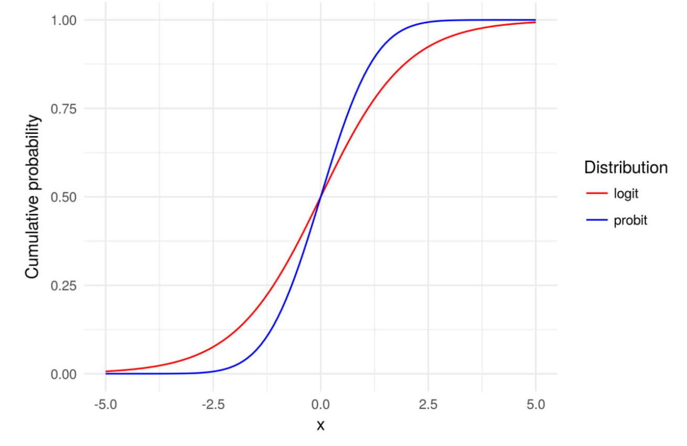

```{r xaringan-themer, include=FALSE, warning=FALSE}
library(xaringanthemer)
style_mono_accent(
  base_color = "#43418A",
  header_font_google = google_font("Josefin Sans"),
  text_font_google   = google_font("Montserrat", "300", "300i"),
  code_font_google   = google_font("Fira Mono")
)
```

```{r setup, include=FALSE}
options(htmltools.dir.version = FALSE)
knitr::opts_chunk$set(warning = FALSE, message = FALSE)
library(bootstrap)
library(ggplot2)
library(tidyverse)
library(fontawesome)
```
class: inverse, center, middle

# Get Started

---
# Binary Data
- A variable is binary if it only has two values, 0 or 1("No" or "Yes", etc.)
  - Did you vote or not?
  - Did a country adopt this policy or not?
  - Did the war or protest end or not?
---
# Why not linear model
- A typical OLS equation looks like:
  $$ Y = \beta_0 + \beta_1X + \varepsilon $$
  and assumes that the error term, $$\varepsilon$$ is normal. 
  
- Running OLS with a binary dependent variable is called **linear probability model**.
- The interpretation is the exact same as regular OLS. The only difference is that our interpretation of the dependent variable is now in probability terms.
- So we say, **a one-unit increase in X is associated with a three percentage point increase in the probability.**

---
# Why not linear model
- We will get prediction outside the interval between 0 and 1.
- Violate the homoscedasticity assumption of OLS.
- By using OLS estimator, we assume linear trend in probabilities.

---
# Generalised Linear Model
- A GLM equation looks like:
 $$E(Y | X) = F(\beta_0 + \beta_1X) $$
- Key differences:
  - **estimated by maximum likelihood**, rather than OLS.
  - **binomial distribution for binary data**, rather than normal distribution.
  - In *R*, we use

---
# Probit vs. Logit
- Logit model is a form of a statistical model that is used to predict the probability of an event occurring
- Probit model is similar to logit model, but it determines the likelihood that an item or event will fall into one of a range of categories by estimating the probability that observation with specific features will belong to a particular category.
- So dependent variable for probit model can only take on **one of the two values, such as yes or no, true or false**.
---
# Probit vs. Logit
Logit models are used to **model logistic distribution** while probit models are used to model the **cumulative standard normal distribution**.

{width=40%}
---
# Interpretation
- Coefficients are log odd-ratios.
- From the coefficients themselves we can get direction (positive/negative) and significance, but not **the size of effect**.
- So we convert them into odds-ratio by exponentiating:

---
# How to interpret odds ratio

---
# Predicted Probability/Marginal effect
- To interpret the effects more clearly, we need to calculate the predicted probability.
  - 
  - And we write, **the predicted probability for the occurrence of an event is XXX**.


