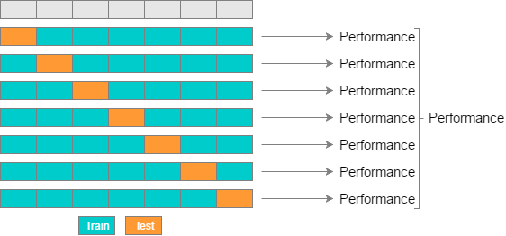

```{r xaringan-themer, include=FALSE, warning=FALSE}
library(xaringanthemer)
style_mono_accent(
  base_color = "#1c5253",
  header_font_google = google_font("Josefin Sans"),
  text_font_google   = google_font("Montserrat", "300", "300i"),
  code_font_google   = google_font("Fira Mono")
)
```

```{r setup, include=FALSE}
options(htmltools.dir.version = FALSE)
knitr::opts_chunk$set(fig.retina = 3, warning = FALSE, message = FALSE)
library(bootstrap)
library(ggplot2)
library(tidyverse)
library(fontawesome)
```
class: inverse, center, middle

# Get Started

What is the difference between parametric or non-parametric?

---
# Bootstrap

- **Definition**: It usually refers to a self-starting process that is to proceed withot external input.
- Applied to statistics: We sample with replace from the sample
---
# Bootstrap
Bootstrap is a desirable approach when:
- **the distribution of a statistic is unknown or complicated**.
- **Reason**: bootstrap is a non-parametric and does not ask foor specific distributions.
- **the sample size is too small to draw a valid inference.**
- **Reason**: it is a resampling method with replacement and recreates any number of resamples.
---
# Let's break down "bootstrap"

Bootstrap breaks down into the following steps:
- decide how many bootstrap samples to perform.
- what is the sample size?
- for each bootstrap sample:
 - draw a sample with replacement with the chosen size
 - calculate the statistic of interest for that sample 
- calculate the mean of the calculated sample statistics.

---
# Bootstrapping Illustration in R

```{r tidy=FALSE}
set.seed(2021)
n <- 20
s <- rnorm(n = n,
           mean = 5.5,
           sd = 1.4)
bp_s <- bootstrap::bootstrap(s, 1000, var)
str(bp_s)
```
---
# Bootstrapping Illustration in R
The list item thetastar (a vector) contains each of the bootrap estimates of the statistic of interest (variance in the present example). It’s always good to plot a histogram of the bootstrap distribution.

```{r tidy=FALSE, fig.height=4}
quickplot(bp_s$thetastar,
          geom = "histogram",
          bins = 25)
```
---
# Or we could write the bootstrap() manually

.pull-left[
```{r plot-last, fig.show = 'hide'}
B <- matrix(0, nrow = 1000, 
            ncol = n)

for (i in 1: 1000){
  B[i, ] <- sample(s, size = n,
                   replace = TRUE)
}

sd_b <- apply(B, 1, sd) # compute SD for each row
hist(sd_b) # inspect the distribution of the SDs
```
]
.pull-right[
```{r ref.label = 'plot-last', echo = FALSE}
```
]
---
class: center, middle 

Other Sampling Approaches 
---
# Jackknife
**It is a leave-one-out procedure.**
It means:
- We copy the existing sample *n* times, and each time, we delete one but different observation.
- Then, we calculate the statistics of interests. 

---
# *K*-cross Validation
- **Divide the data into k parts and predict one left out segment based on a model of the remaining k − 1 segments;**
- **Then assess distribution of prediction error.**



---
# Permutation Tests
- To compare outcomes in experiments, we often do a two-sample t-test. 
- It assumes that data are randomly selected from the population, arrived in large samples (>30), or normally distributed with equal variances between groups.
- But we could also o a permutation test, **without any distributional assumptions.**

---
# Permutation Tests in R
```{r}
set.seed(2021)
dat <- data.frame(group = c(rep("t", 10),
                            rep("c", 10)),
                  mark = c(rnorm(10, 69, 10),
                           rnorm(10, 57, 10)))
head(dat)
```
---
# Permutation Test in R
- First, we compute the difference in means.
```{r}
obs <- mean(dat$mark[dat$group == "t"]) - 
  mean(dat$mark[dat$group == "c"])
obs
```

- Then, we perform the *t* test.
```{r}
t.test(dat$mark[dat$group == "t"], dat$mark[dat$group == "c"])
```

---
# Permutation Test in R
.pull-left[
```{r plot-a, fig.show = 'hide'}
d <- numeric(1000)
for (i in 1:1000){
  dat2 <- dat
  dat$group <- sample(dat2$group, 
                      replace = FALSE)
  d[i] <- mean(dat$mark[dat$group == "t"]) - 
  mean(dat$mark[dat$group == "c"])
} 
# Here, we re-assign groups labels randomly,
# and then re-compute the difference in group 
# means again;
# we repeat these steps.
# Eventually, this yields a distribution of differences.

hist(d)
abline(v = quantile(d, 0.95),
       col = "blue",
       lwd = 3)
abline(v = obs,
       col = "red",
       lwd = 3)
```
]

.pull-right[
```{r ref.label = 'plot-a', echo = FALSE}
```
]